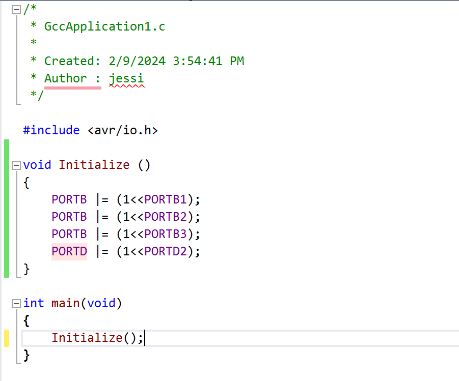
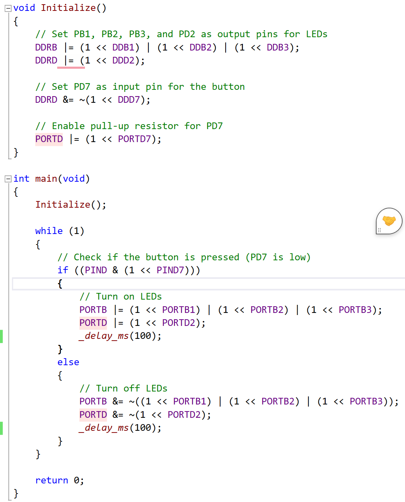
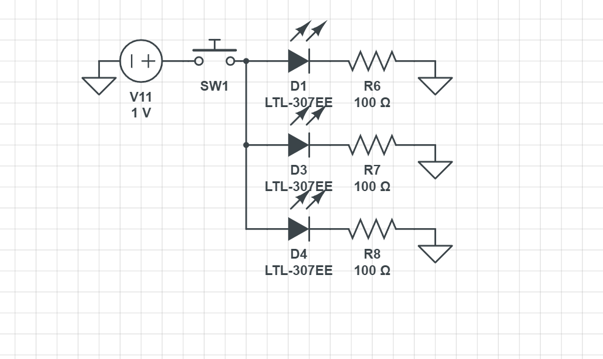
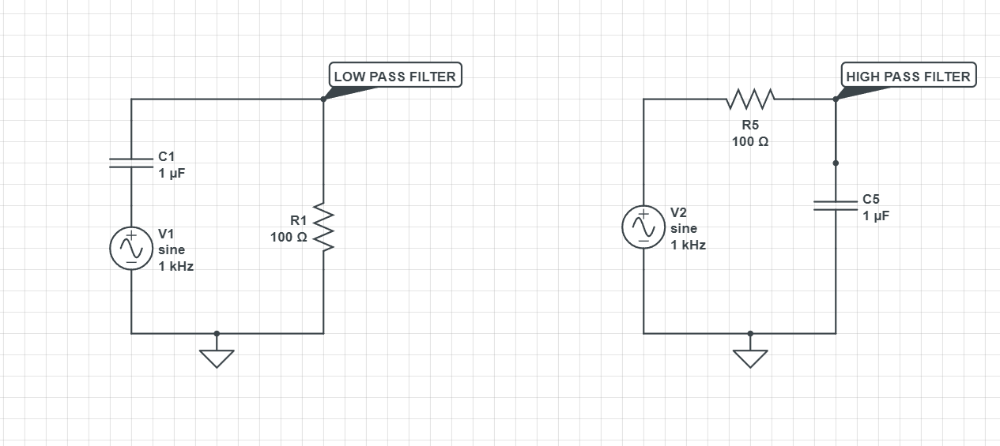
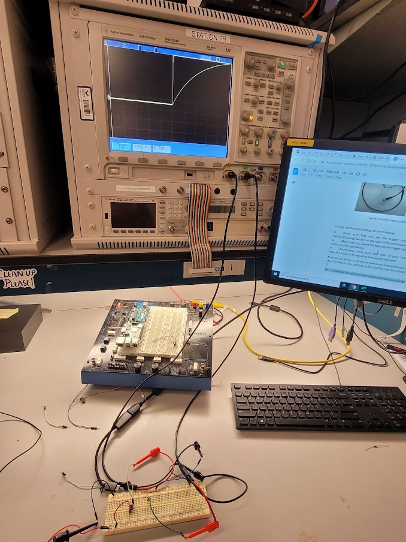
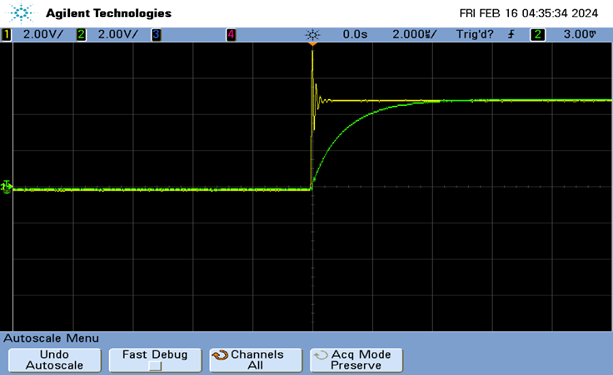
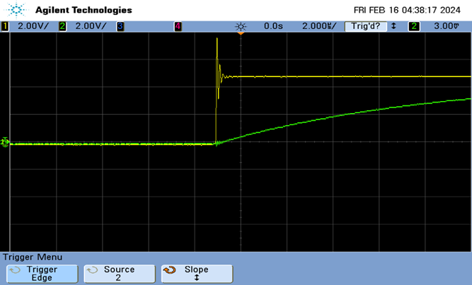

# lab2_morse_skeleton

    * Name: Jessi Jha
    * Github Repository URL: 
    * Description of hardware: Resistors, Capacitors, Switch, ATmega328PB, LEDs 

## Part A: Warming Up with LEDs

### 0 - Using your new found (or honed skill) of Morse code, what message did Jason in the comic on the first page tap out?

### 1 - Hooray! You just wrote your first AVR C code! Take a screenshot of your code. It should only be a few lines. No need to include the “include <avr/io.h>” or header file lines. Just the main function.  (Refer to the examples in lecture.)

### 2 - Take a screenshot of your code. It should only be a few lines. No need to include the “include <avr/ioh.h>” lines. Just the main function.  (Refer to the examples in lecture.)

### 3 - Take a screenshot of your code. It should only be a few lines. No need to include the “include <avr/ioh.h>” lines. Just the main function.  (Refer to the examples in lecture.)

Lorem ipsum

### 4 - Use CircuitLab to draw your schematic. Attach an image to your answer to this question

## Part B: Now, Using Interrupts

### 5 - Give an advantage and a disadvantage to using interrupts over polling for this task

Advantages:
- Interrupts are useful for infrequent events
- Fast MCU response

Disadvantages:
- Interrupts not intended for time critical responses

## Part C: Dash or Dot

### 6 - For a 16MHz clock, how many “ticks” are in 30ms, 200ms, and 400ms?

30ms: 480000

200ms: 3200000

400ms: 6400000

### 7 - Describe how a prescaler allows us to work with a wider range of frequencies on our microcontroller

A prescaler lowers the frequency at which you timer overflows, therefore allowing you to work with smaller frequencies. 

## Part D: Putting It Together - LEDs and ASCII

### 8 - Recall what you have learned before about RC circuits. Use just a resistor and a capacitor, create two separate circuits that function as a high pass filter and a low pass filter. Draw sketches of each of these circuits (or build them in Circuit Lab) and submit them.

## Part E: The (Dot) Dash to the Finish

### 9 - Submit a photo of your circuit setup. 

### 10 - Submit a photo/screenshot of your oscilloscope reading.

### 11 - Repeat the previous question by changing the capacitance for C1 to 10nF. Submit a photo of your result.  

### 12 - Which capacitance is more desirable for hardware debouncing? Why? Hint: try zooming in to see the voltage behavior when the button is just pressed.

The 1nF is more desirable for debouncing because it charges faster (it has a smaller RC time constant). This means it looks more similar to rising edge for a smaller time step.

### CODE: Write a program that takes in a message or word, translates it to morse code, and then flashes an LED according to the morse code generated. Since we haven’t learned about serial communication yet, the message/word can be a hardcoded string in your code that you manually edit, compile, and flash each time you want to change the word. Submit a video of this demo

## Github Repo Submission Resources

* [ESE5160 Example Repo Submission](https://github.com/ese5160/example-repository-submission)
* [Markdown Guide: Basic Syntax](https://www.markdownguide.org/basic-syntax/)
* [Adobe free video to gif converter](https://www.adobe.com/express/feature/video/convert/video-to-gif)
* [Curated list of example READMEs](https://github.com/matiassingers/awesome-readme)
* [VS Code](https://code.visualstudio.com/) is heavily recommended to develop code and handle Git commits
  * Code formatting and extension recommendation files come with this repository.
  * Ctrl+Shift+V will render the README.md (maybe not the images though)
